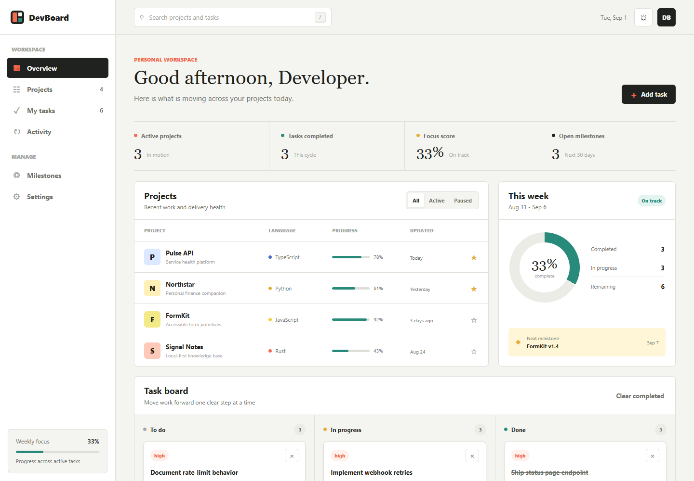

# DevBoard

> A calm, local-first developer workspace for projects, tasks, milestones, and daily progress.

DevBoard is a dependency-free productivity dashboard built with semantic HTML, modern CSS, and vanilla JavaScript. It is designed as a polished GitHub portfolio project: useful on first launch, easy to understand, testable without a build pipeline, and ready to publish with GitHub Pages.



[中文说明](#中文说明) | [Features](#features) | [Quick start](#quick-start) | [Architecture](#architecture) | [Roadmap](#roadmap)

## Why DevBoard?

Developer work is usually spread across repositories, issue trackers, notes, and calendars. DevBoard presents that work in one focused local workspace without requiring an account, backend, or external service.

The included sample data makes the interface useful immediately. Every change is persisted to `localStorage`, so the dashboard behaves like a real application while remaining simple enough to inspect in a few minutes.

## Features

- **Project overview** with language, health, progress, favorites, and update times
- **Interactive task board** with to-do, in-progress, and completed columns
- **Task management** for creating, moving, completing, deleting, and clearing work
- **Global search** across project names, descriptions, languages, tasks, and priorities
- **Project filters** for all, active, and paused work
- **Live metrics** derived from the current workspace state
- **Milestone tracking** with delivery dates and progress indicators
- **Activity stream** that records meaningful workspace changes
- **Local persistence** with no sign-in, database, or network request
- **Light and dark themes** that respect the system preference
- **Responsive navigation** for desktop, tablet, and mobile screens
- **Keyboard and accessibility details**, including focus styles, semantic regions, labels, dialogs, and reduced-motion support
- **Automated tests** using the Node.js built-in test runner
- **GitHub Actions** for CI and optional GitHub Pages deployment

## Quick start

### Option 1: Run with Node.js

Requirements: Node.js 18 or newer.

```bash
git clone https://github.com/YOUR_USERNAME/devboard.git
cd devboard
npm start
```

Open [http://127.0.0.1:4173](http://127.0.0.1:4173).

### Option 2: Use any static server

DevBoard has no package dependencies. You can serve the repository with any local HTTP server:

```bash
python -m http.server 4173
```

Then open [http://127.0.0.1:4173](http://127.0.0.1:4173).

## Available commands

| Command | Purpose |
| --- | --- |
| `npm start` | Start the included static development server |
| `npm test` | Run unit tests with `node:test` |
| `npm run check` | Validate JavaScript syntax |

No `npm install` step is required because the project has no runtime or development dependencies.

## Using the app

1. Use the search field to filter projects and tasks together.
2. Switch project status with the segmented control above the project table.
3. Select **Add task** to create a task with a project, priority, status, and due date.
4. Use the arrow controls on a task to move it between board columns.
5. Mark a task complete with the check control.
6. Toggle the sun/moon control to switch themes.
7. Use **Reset sample data** to restore the original workspace.

Keyboard shortcut: press `/` while you are not typing to focus global search.

## Architecture

```text
devboard/
|-- .github/
|   `-- workflows/          # CI and GitHub Pages automation
|-- src/
|   |-- app.js              # Browser state, rendering, and interactions
|   `-- core.js             # Pure workspace data functions
|-- test/
|   `-- core.test.js        # Unit tests for data behavior
|-- index.html              # Semantic application shell
|-- styles.css              # Responsive visual system and themes
|-- server.js               # Small dependency-free static server
|-- CONTRIBUTING.md
|-- SECURITY.md
|-- LICENSE
`-- package.json
```

### Data flow

```text
User action -> update workspace state -> save localStorage -> derive metrics -> render UI
```

`src/core.js` uses a small UMD wrapper so the same pure functions can run in the browser and in Node.js tests. UI state and DOM behavior remain in `src/app.js`. This keeps the testable domain logic separate without adding a bundler.

### Local data model

The workspace contains four collections:

- `projects`: project metadata, status, progress, and language information
- `tasks`: title, project relation, board status, priority, and due date
- `milestones`: delivery target, date, and completion percentage
- `activity`: a short chronological record of local actions

Data is stored under the browser key `devboard-workspace-v1`. DevBoard does not collect analytics or send data to a server.

## Design decisions

- **Local-first:** the demo remains useful without API credentials or a backend.
- **Zero dependencies:** new contributors can run it immediately and audit every part of the stack.
- **Progressive complexity:** the current architecture can later add a REST or GraphQL adapter without replacing UI behavior.
- **Accessible defaults:** controls are keyboard reachable, icon buttons have names, focus is visible, and motion preferences are respected.
- **Portfolio ready:** sample content, complete documentation, tests, CI, and Pages deployment are included.

## Testing

Run all tests:

```bash
npm test
```

The tests cover:

- workspace normalization and invalid status recovery
- computed dashboard statistics
- cross-project and task search
- project status filtering
- task movement boundaries
- immutable clearing of completed tasks

## Deploying to GitHub Pages

The repository includes `.github/workflows/pages.yml`. To publish:

1. Push the repository to GitHub with `main` as the default branch.
2. Open **Settings > Pages** in the repository.
3. Set **Source** to **GitHub Actions**.
4. Push to `main` again or run the **Deploy GitHub Pages** workflow manually.

The site will be available at:

```text
https://YOUR_USERNAME.github.io/devboard/
```

## Roadmap

- [ ] Import public repository data from the GitHub REST API
- [ ] Drag-and-drop task ordering with accessible keyboard alternatives
- [ ] Workspace export and import as JSON
- [ ] Custom projects and milestones
- [ ] Offline installation with a service worker
- [ ] End-to-end browser tests

## Contributing

Issues and pull requests are welcome. Read [CONTRIBUTING.md](CONTRIBUTING.md) for the development workflow and contribution expectations.

For security reports, follow [SECURITY.md](SECURITY.md).

## License

Released under the [MIT License](LICENSE).

---

## 中文说明

DevBoard 是一个本地优先的开发者工作台，用来集中查看项目、任务、里程碑与近期活动。项目使用原生 HTML、CSS 和 JavaScript 编写，不需要安装第三方依赖，也不需要注册账号或配置后端。

### 核心能力

- 项目列表、技术语言、进度与收藏状态
- 待办、进行中、已完成三列任务看板
- 新增、移动、完成、删除与批量清理任务
- 同时搜索项目与任务
- 根据项目状态筛选
- 自动计算任务完成率、专注分数和开放里程碑
- 明暗主题与移动端响应式布局
- 浏览器本地持久化，刷新页面不会丢失修改
- Node.js 原生单元测试、CI 与 GitHub Pages 发布流程

### 本地运行

```bash
npm start
```

然后访问 `http://127.0.0.1:4173`。项目没有第三方依赖，因此不需要先执行 `npm install`。

### 运行测试

```bash
npm test
npm run check
```

### 隐私

DevBoard 的数据只保存在当前浏览器的 `localStorage` 中，不会上传到任何服务器。使用“Reset sample data”可以清除修改并恢复示例数据。

### 后续扩展方向

当前版本刻意保留了清晰的数据边界。若要接入真实 GitHub 数据，可以在 `src/core.js` 和页面渲染之间增加一个数据适配层，通过 GitHub REST API 获取公开仓库、Issue 和 Pull Request，同时保留现有的本地演示模式。
